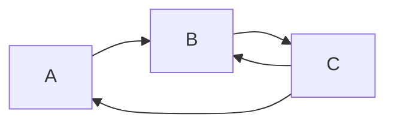
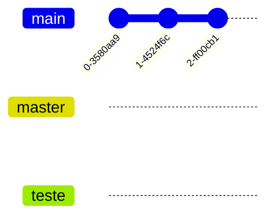
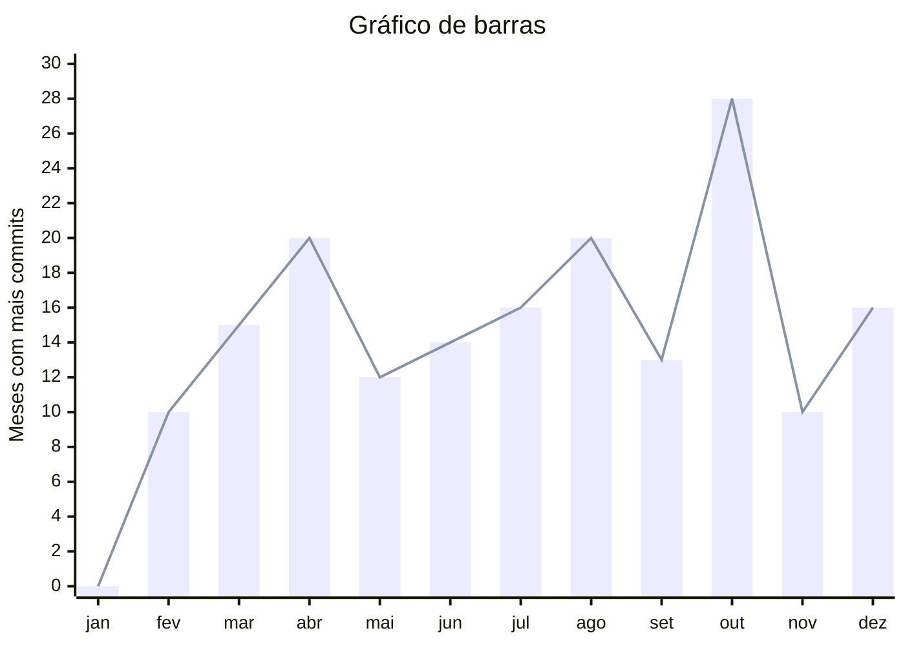

# Assembly-basico-estudo
Neste repositório, tento aprender o básico de assembly na arquitetura x86_64 da Intel e trazer um pouco dessa trajetória, isso será algo mais como hobby e sem o intúito de deixar isso como algum projeto ultra oficial.

